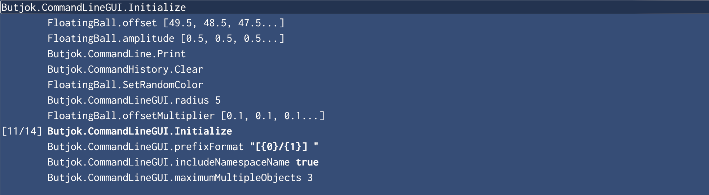

CommandLine for Unity
=
A command line prompt for Unity projects.




Features
-
- **Autocompletion:** Navigate suggestions with Tab and Shift-Tab.
- **History:** Lookup the history with ↑ and ↓.
- **Syntax highlighting**.
- Works both for static and non-static members. Non-static members are supported only for classes derived from `UnityEngine.Object`
- Works for multiple `MonoBehaviour`s in a scene.
- Command names are generated automatically.
- Partial name matching.
- Builtin operators: `!`,`~`,`+`,`-`,`*`,`/`,`%`. Work with overloads as well.
- Variable and command interpolation: `MyCommand $Variable` or `MyCommand ${MyOtherCommand 1 2 "hello"}`

Usage
-
Add a `[Command]` attribute to a field, property or method. Works for static members of any class and also for non-static members of `MonoBehaviour`.
```c#
public class Person : MonoBehaviour {
    
    // Works with non-static methods. 
    // The Walk() method will called for every Person loaded.
    [Command] 
    public void Walk() { /*...*/ }
    
    // Supports arguments (currently supports bool, int, float, Color, Vector2Int).
    [Command]
    public void ConsumeFood(float quantity) { /*...*/ }
    
    // Works with fields and properties.
    [Command]
    public int money = 100000;
    public int Age => /*...*/;
    
    // Works with static members as well
    [Command]
    public static int AverageAge => /*...*/;
}
```
  